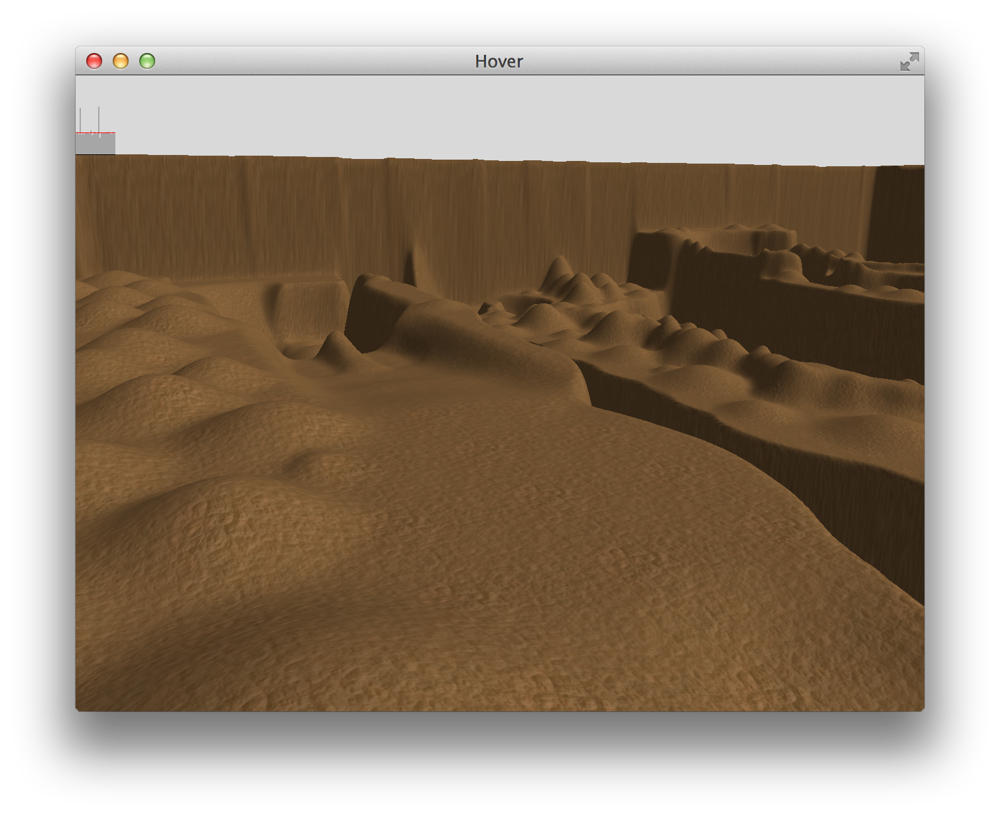

Hover
=====

[](https://pkg.go.dev/github.com/shurcooL/Hover)

Hover is a work-in-progress [source port](https://en.wikipedia.org/wiki/Source_port) of Hover, a game [originally created](https://www.flipcode.com/archives/11-21-2000.shtml) by Eric Undersander in 2000.


The goal of the port is to run on multiple platforms (macOS, Linux, Windows, browser,
iOS, Android) and improve technical aspects (e.g., support for higher resolutions),
while preserving the original gameplay.

Installation
------------

You'll need to have OpenGL headers (see [here](https://github.com/go-gl/glfw#installation)).

```sh
go install github.com/shurcooL/Hover@latest
```

Screenshot
----------

The port is incomplete; this screenshot represents the current state.



Directories
-----------

| Path                                                        | Synopsis                                                                             |
|-------------------------------------------------------------|--------------------------------------------------------------------------------------|
| [track](https://pkg.go.dev/github.com/shurcooL/Hover/track) | Package track defines Hover track data structure and provides loading functionality. |

License
-------

-	[MIT License](LICENSE)
